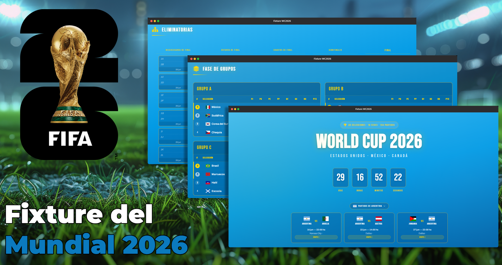

<div align="center">



# ⚽ FIFA World Cup 2026 — Fixture Completo

**48 selecciones · 12 grupos · 104 partidos · 16 sedes**

[](https://fixturewc2026.pages.dev/)
[](https://firebase.google.com)
[](https://site.api.espn.com)
[](.github/workflows/espn-sync.yml)
[](https://creativecommons.org/licenses/by-nc-nd/4.0/)

<br>

[🌐 Ver en vivo](https://fixturewc2026.pages.dev/) ·
[🏆 Predicción AI](PREDICCION_AI.md) ·
[☕ Cafecito](https://cafecito.app/mozz_vader) ·
[📩 Contacto](https://mozzdev.pages.dev/))

</div>

---

## ✨ Características

### 🏟️ Fase de Grupos
- 12 grupos × 4 selecciones (48 equipos en total)
- 72 partidos con fecha, hora, sede y ciudad
- Tabla de posiciones calculada automáticamente (PTS, PJ, G, E, P, GF, GC, DG)
- Actualización en tiempo real via Firebase `onSnapshot` listeners
- Clasificación automática a Dieciseisavos (1ros, 2dos y 8 mejores 3ros)

### 🏆 Fase Eliminatoria
- Bracket visual completo: R32 → R16 → QF → SF → 3er puesto + Final
- 60 partidos en total
- Auto-propagación de ganadores a la siguiente ronda
- Soporte para tiempos extras y penales
- Cruces correctos entre fases con `FEEDER_MAP`

### 📡 Datos en Tiempo Real
- Firebase Firestore como backend serverless
- ESPN Public API como fuente de datos en vivo (sin API key)
- GitHub Actions polling cada **2 minutos** durante días de partido
- CORS proxy fallback para consultas desde el browser
- Toast notifications con sonido para goles, inicio y fin de partidos

### 🔔 Notificaciones en Vivo
- Toasts visuales con distintos colores por evento (gol, tarjeta, inicio, fin)
- Sonido de silbato con Web Audio API (silenciable)
- Notificaciones de escritorio (Desktop Notifications)
- Detección inteligente de cambios: solo dispara en `modified`, ignora snapshot inicial

### 📊 Estadísticas
- Tabla de goleadores con goles y asistencias
- Tabla de tarjetas (amarillas y rojas)
- 16 sedes con estadio, ciudad y país
- Datos actualizados en tiempo real

### 🔐 Panel de Administración
- Login con Firebase Auth (email/password)
- Cargar partidos de grupos y eliminatorias
- Calcular clasificados automáticamente
- Propagar ganadores por el bracket
- Predicción AI completa (132 partidos + goleadores + tarjetas)
- ESPN Live Test con ligas activas

### 🤖 Predicción AI
- Predicción completa de los 132 partidos del torneo
- Campeón predicho: **Argentina** 🇦🇷 (2-1 vs Brasil en tiempo extra) - *Anulo Mufa*
- Documento detallado: [`PREDICCION_AI.md`](PREDICCION_AI.md)

---

## 🛠️ Stack Técnico

| Componente | Tecnología |
|---|---|
|  Frontend | HTML5, CSS3, JavaScript vanilla |
|  Estilos | CSS Grid, Flexbox, Custom Properties |
|  Iconos | Font Awesome 6, flag-icons 7 |
|  Backend | Firestore (serverless) + Auth |
|  Datos en vivo | ESPN Public API |
|  CI/CD | Polling cada 2 min |
|  Hosting | Static site |

---

## 📁 Estructura del Proyecto

```
FixtureWC2026/
├── index.html              # Sitio principal
├── admin-seed.html         # Panel de administración
├── PREDICCION_AI.md        # Predicción AI completa
├── robots.txt              # SEO crawlers
├── sitemap.xml             # SEO sitemap
├── img/
│   └── og-image.png        # Open Graph image
│
├── css/
│   ├── global.css          # Reset, variables, layout, footer
│   ├── navbar.css          # Barra de navegación
│   ├── hero.css            # Hero section + countdown
│   ├── calendar.css        # Calendario de partidos
│   ├── toast.css           # Toast notifications
│   ├── groups.css          # Tablas de grupos
│   ├── bracket.css         # Bracket de eliminatorias
│   └── stats.css           # Estadísticas
│
├── js/
│   ├── data.js             # MATCHES (72), KNOCKOUT (60), TEAMS, FEEDER_MAP
│   ├── firebase-config.js  # Config Firebase
│   ├── firebase.js         # Firestore listeners, ESPN polling, auto-qualify
│   ├── toast.js            # Toast notification system + Web Audio API
│   └── app.js              # UI logic principal
│
├── scripts/
│   ├── espn-poller.js      # ESPN → Firestore (GitHub Actions)
│   └── test-espn-api.js    # ESPN API testing
│
└── .github/workflows/
    └── espn-sync.yml       # Poll ESPN cada 2 min
```

---

## 🚀 Setup

### 1️⃣ Firebase
1. Crear proyecto en [Firebase Console](https://console.firebase.google.com/)
2. Agregar app web y copiar la config
3. Crear `js/firebase-config.js`:
   ```js
   const FIREBASE_CONFIG = {
     apiKey: "...",
     authDomain: "...",
     projectId: "...",
     storageBucket: "...",
     messagingSenderId: "...",
     appId: "..."
   };
   const FIREBASE_ENABLED = true;
   ```
4. Crear usuario en Firebase Auth (Email/Password)
5. Configurar `firestore.rules`

### 2️⃣ Datos Iniciales
1. Abrir `admin-seed.html` en el browser
2. Loguearse con el usuario creado
3. Click en **"Predicción AI Completa"** para cargar todo

### 3️⃣ ESPN Live Sync (GitHub Actions)
1. Crear Service Account en Firebase Console → Project Settings → Service Accounts
2. Agregar 3 secrets en el repo:
   - `FIREBASE_PROJECT_ID`
   - `FIREBASE_PRIVATE_KEY`
   - `FIREBASE_CLIENT_EMAIL`
3. El workflow se activa automáticamente en Jun-Jul 2026

### 4️⃣ Hosting
Cualquier host estático funciona (GitHub Pages, Netlify, Vercel, etc). No necesita servidor.

---

## 📡 ESPN API Mapeo

Se mapearon las 72 competiciones de ESPN a los 72 partidos de fase de grupos:

| Fase | Rango ESPN | Partidos |
|---|---|---|
| Fecha 1 | 1001 – 1012 | 12 partidos |
| Fecha 2 | 2001 – 2012 | 12 partidos |
| Fecha 3 | 3001 – 3012 | 12 partidos |

---

## 📌 Notas

- 💡 El sitio es **100% client-side**. No hay backend propio.
- 🔥 Firebase Firestore se usa solo como base de datos en tiempo real.
- ⚡ La API de ESPN es pública y no requiere API key.
- ⏱️ El workflow de GitHub Actions tiene un timeout de 6 minutos (3 iteraciones × 120s sleep + polling).
- 🤖 Las predicciones AI se generaron con criterios futbolísticos (ranking FIFA, calidad de plantilla, rendimiento reciente).
- 🇦🇷 **Argentina campeón** (4ta estrella: 1978, 1986, 2022, 2026). Datos + deseo. **ANULO MUFA** 🤞

---

## 📜 Licencia

Este proyecto está licenciado bajo [Creative Commons Attribution-NonCommercial-NoDerivatives 4.0 International (CC BY-NC-ND 4.0)](https://creativecommons.org/licenses/by-nc-nd/4.0/).

- ✅ **Compartir** — copiar y redistribuir el material en cualquier medio o formato
- ✅ **Atribución** — se debe dar crédito adecuado, proporcionar un enlace a la licencia e indicar si se realizaron cambios
- ❌ **No Comercial** — no se puede utilizar el material para fines comerciales
- ❌ **No Derivadas** — no se pueden remezclar, transformar ni construir sobre el material

Los datos del fixture pertenecen a FIFA. Las predicciones son ficción *(o no... elijo creer)*.

<div align="center">

**Hecho con ❤️ y 🇦🇷 por [MozzVader](https://github.com/mozzvader) y Super Z**

[☕ Invitame un cafecito](https://cafecito.app/mozz_vader)

</div>
